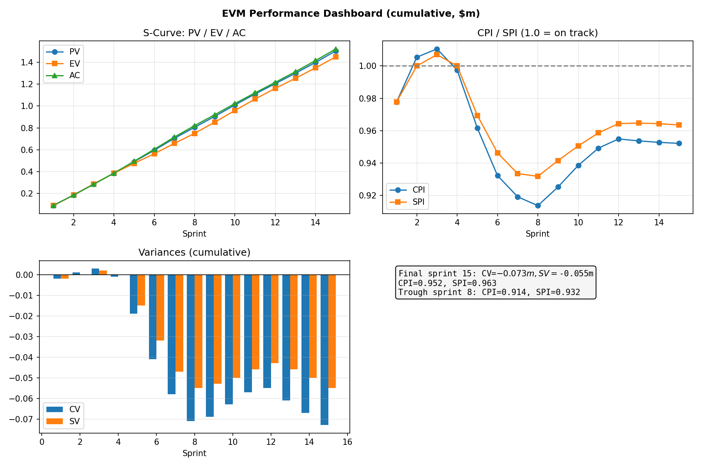
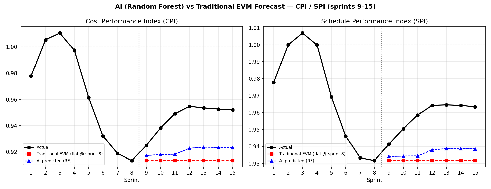

# Earned Value Management with AI-Enhanced Forecasting

Analysis of a 15-sprint software project comparing classical EVM forecasting against a Random Forest model for cost and schedule performance prediction.

## Overview

This repository contains a complete EVM workflow on synthetic sprint data (values in $m). Budget at Completion (BAC) is $1.505m. Sprints 1–8 are used as history; sprints 9–15 are held out to evaluate forecasts.

Project narrative encoded in the data:

* Sprints 1–4: on track, variances near zero
* Sprints 5–8: deterioration due to scope creep and overruns
* Sprints 9–12: partial recovery
* Sprints 13–15: plateau with slight slip, ending over budget and behind schedule

## Methods

1. **Variance calculation:** `CV = EV − AC`, `SV = EV − PV` per sprint, cumulative basis.
2. **Performance indices:** `CPI = EV / AC`, `SPI = EV / PV`. Trough at sprint 8: CPI 0.914, SPI 0.932.
3. **Classical forecasting at sprint 8:**
   * Typical (efficiency continues): `EAC = BAC / CPI` → $1.647m
   * Atypical (return to planned rate): `EAC = AC + (BAC − EV)` → $1.576m
   * Composite (bonus): `EAC = AC + (BAC − EV) / (CPI × SPI)` → $1.708m
   * Actual final cost was $1.523m. The atypical formula was closer because the team recovered after sprint 8.
4. **AI-enhanced forecasting:** Multi-output `RandomForestRegressor (n_estimators=300, max_depth=4, random_state=9)` trained on sprints 1–8 to predict CPI/SPI for sprints 9–15. Features: `sprint_id, cum_PV, cum_EV, cum_AC, CV, SV, CPI_lag1, SPI_lag1`. Baseline is traditional flat-line CPI/SPI held at sprint-8 values.

## Results

Final sprint (15): `CV = $-0.073m, SV = $-0.055m, CPI = 0.952, SPI = 0.963`.

Forecast error on sprints 9–15:

| Metric | Random Forest | Traditional (flat) |
|---|---|---|
| CPI MAE | 0.0255 | 0.0330 |
| CPI RMSE | 0.0267 | 0.0346 |
| SPI MAE | 0.0215 | 0.0265 |
| SPI RMSE | 0.0225 | 0.0278 |

The flat EVM forecast froze CPI/SPI at the sprint-8 trough and under-predicted every recovery sprint. The Random Forest predicted a partial rebound (CPI ~0.918–0.924, SPI ~0.934–0.939) — directionally correct but below the actual recovery to CPI ~0.955 / SPI ~0.964, because the training window contained no recovery example. Full per-sprint comparison is in `report.md`.

## Visuals

### Performance dashboard (S-curve, CPI/SPI, variances)



### AI vs traditional forecast (CPI/SPI, sprints 9–15)



## Repository contents

| File | Description |
|---|---|
| `evm_analysis.py` | Reproducible pipeline: dataset → EVM metrics → forecasts → charts → `report.md` |
| `evm_ai_forecast.ipynb` | Notebook version of the same pipeline for interactive use |
| `evm_table.csv` | Full cumulative EVM table with variances, indices, and lag features |
| `evm_dashboard.png` | S-curve, CPI/SPI trends, CV/SV bars |
| `evm_forecast_comparison.png` | Actual vs flat EVM vs Random Forest trajectories |
| `report.md` | Generated numerical report with variance and forecast tables |

## Reproduce

```bash
pip install -r requirements.txt
python evm_analysis.py
```

This regenerates `evm_table.csv`, `evm_dashboard.png`, `evm_forecast_comparison.png`, and `report.md`.

Alternatively, open `evm_ai_forecast.ipynb` and select Run All.
